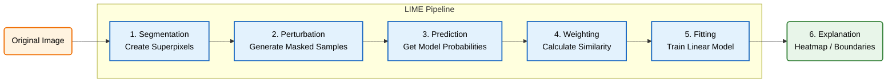

```mermaid
flowchart LR
    %% Define styles
    classDef process fill:#e3f2fd,stroke:#1565c0,stroke-width:2px,color:black;
    classDef input fill:#fff3e0,stroke:#ef6c00,stroke-width:2px,color:black;
    classDef output fill:#e8f5e9,stroke:#2e7d32,stroke-width:2px,color:black;

    %% Nodes
    Img(Original Image)
    
    subgraph LIME [LIME Pipeline]
        direction TB
        S1[1. Segmentation<br/>Create Superpixels]
        S2[2. Perturbation<br/>Generate Masked Samples]
        S3[3. Prediction<br/>Get Model Probabilities]
        S4[4. Weighting<br/>Calculate Similarity]
        S5[5. Fitting<br/>Train Linear Model]
    end
    
    Exp(6. Explanation<br/>Heatmap / Boundaries)

    %% Connections
    Img --> S1
    S1 --> S2
    S2 --> S3
    S3 --> S4
    S4 --> S5
    S5 --> Exp

    %% Apply Styling
    class Img input;
    class S1,S2,S3,S4,S5 process;
    class Exp output;
```