# Data Analysis

---

## Original Dataset

| Dataset | Total | Normal | Pneumonia | Normal % | Pneumonia % | Ratio |
| :--- | :---: | :---: | :---: | :---: | :---: | :---: |
| **Train** | 5216 | 1341 | 3875 | 25.7% | 74.3% | 1:2.89 |
| **Validation** | 16 | 8 | 8 | 50.0% | 50.0% | 1:1.00 |
| **Test** | 624 | 234 | 390 | 37.5% | 62.5% | 1:1.67 |

Validation set is too small (only 16 samples)

---

## Redistributed Dataset

Combine train/val and split with ratio **0.8:0.2**

| Dataset | Total | Normal | Pneumonia | Normal % | Pneumonia % | Ratio |
| :--- | :---: | :---: | :---: | :---: | :---: | :---: |
| **Train** | 4185 | 1079 | 3106 | 25.8% | 74.2% | 1:2.88 |
| **Validation** | 1047 | 270 | 777 | 25.8% | 74.2% | 1:2.88 |
| **Test** | 624 | 234 | 390 | 37.5% | 62.5% | 1:1.67 |

---

## Leakage Check

| Train-Val | Train-Test | Val-Test |
| :---: | :---: | :---: |
| 0 ✅ | 0 ✅ | 0 ✅ |

**No data leakage detected!**

---

## Class Distribution

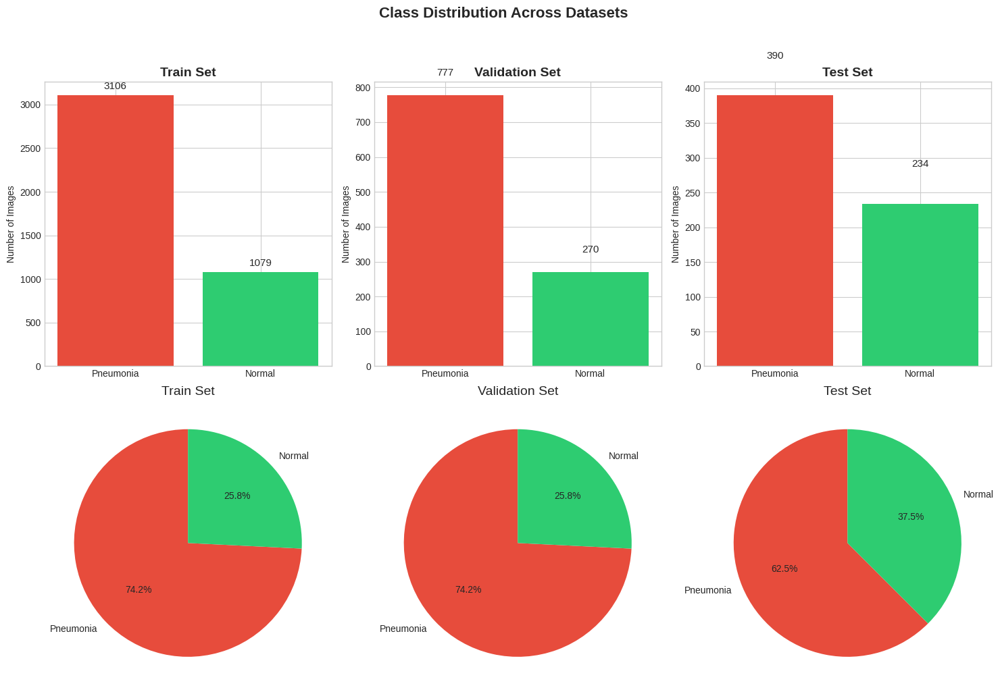

Classes are imbalanced, Use **oversampling** during training

---

## Pixel Intensity Analysis

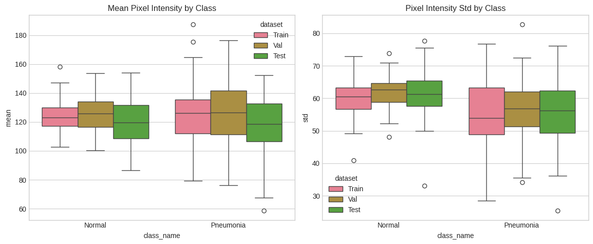

Use **intensity/contrast augmentation** to improve generalization

---

## Sample Visualization (Train)

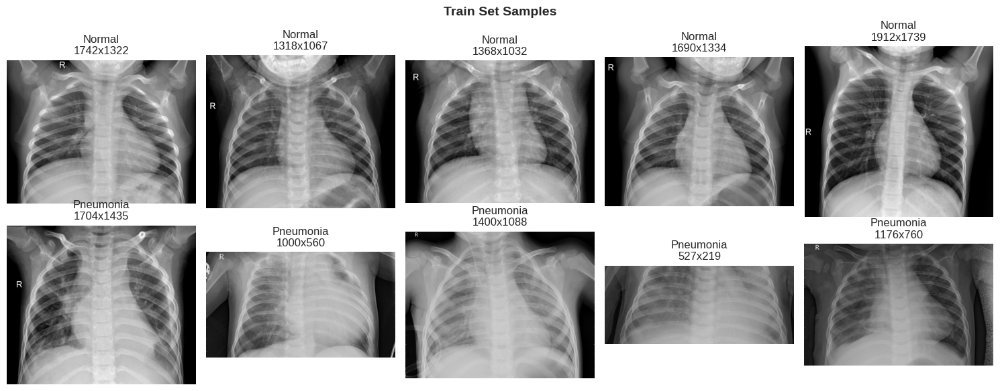

---

## Sample Visualization (Test)

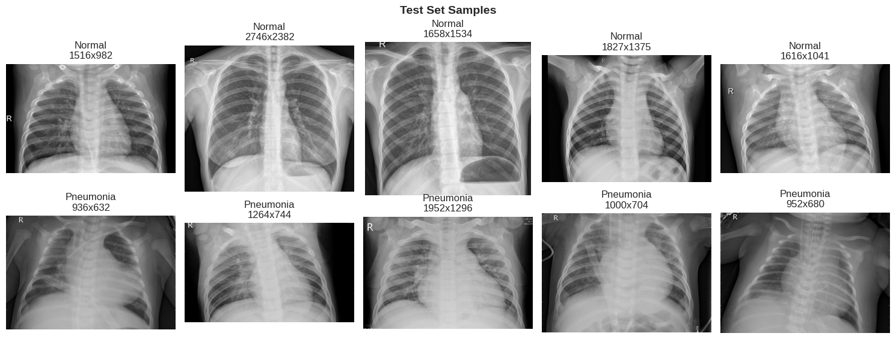

Pneumonia images show higher opacity: **Ground-Glass Opacity**

---

## Average Image Analysis (Train)

---

## Average Image Analysis (Test)

Most differences are in **lung regions** where pneumonia shows higher opacity

---

# Model 
---
## Model Setup
- Base Model: Resnet 18.
- Loss Function: **BCEWithLogitsLoss**
- Optimizer: Adam
- Learning Rate Schedule: **ReduceLROnPlateau**
- Early Stop: quit training after 7 epoch no improvement.
- Oversample: Use **WeightedRandomSampler** for training set.

---

## Cross Validation 
Run 5-Fold cross validation to pick best augmentation hyperparameters.
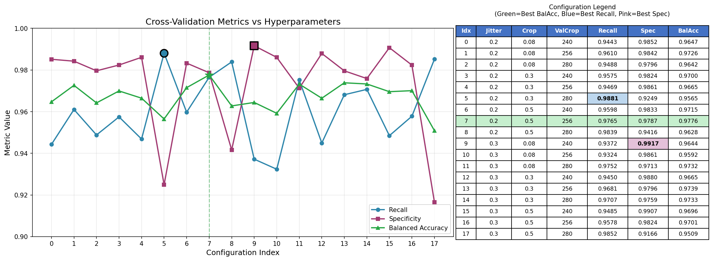

---
## Training

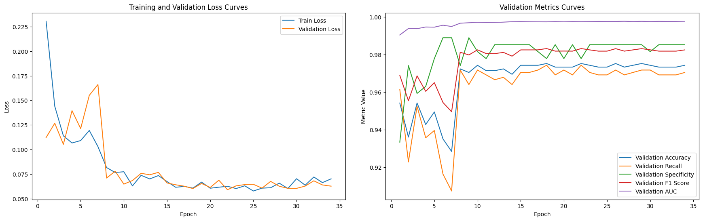

---
### Confusion Matrix
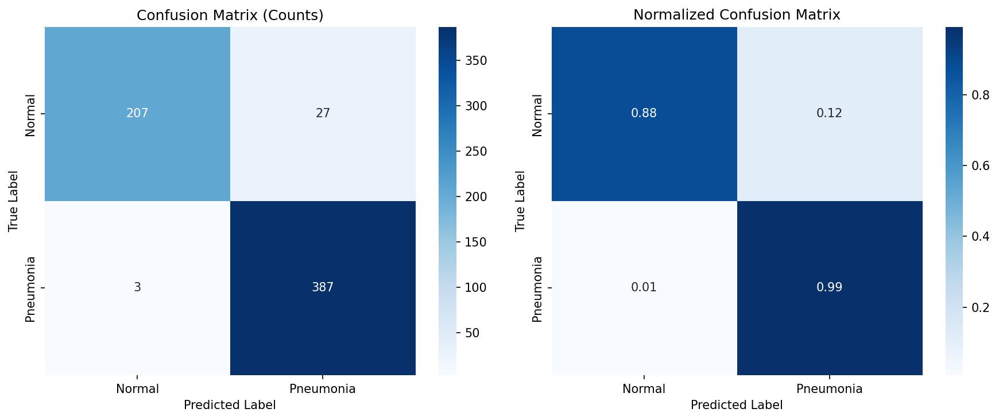

---

## Comparison To Baseline
| Configuration | Accuracy | Recall | Specificity | F1 Score | AUC |
|---------------|----------|--------|-------------|----------|-----|
| Baseline (jitter=0.1, No crop) | 0.8606 | 0.9949 | 0.6368 | 0.8992 | 0.9662 |
| jitter=0.3, crop=0.08-1.0 | **0.9583** | 0.9872 | **0.9103** | **0.9673** | **0.9923** |
| **jitter=0.2, crop=0.5-1.0** | 0.9519 | **0.9923** | 0.8846 | 0.9627 | 0.9890 |

**Key Observations:**
- All models achieve the same high Recall(>0.98), detecting nearly all Pneumonia cases
- The main improvement is in **Specificity** (Normal class detection): 0.6368 to 0.9103

---
# Explain
---
## Grad Cam
### Pipeline
1. **Compute Gradients**: Calculate the gradient of the score for class $c$, $y^c$, with respect to the feature map activations $A^k$ of a convolutional layer:
    $$ \frac{\partial y^c}{\partial A^k} $$
2. **Global Average Pooling (Neuron Importance)**: These gradients are global-average-pooled to obtain the neuron importance weights $\alpha_k^c$:
    $$ \alpha_k^c = \frac{1}{Z} \sum_i \sum_j \frac{\partial y^c}{\partial A_{ij}^k} $$
    This weight $\alpha_k^c$ captures the "importance" of feature map $k$ for a target class $c$.
---
3.  **Weighted Combination**: Perform a weighted combination of forward activation maps, followed by a ReLU:
    $$ L_{Grad-CAM}^c = ReLU\left(\sum_k \alpha_k^c A^k\right) $$
    
    *   **ReLU** is applied because we are only interested in features that have a *positive* influence on the class of interest. Negative pixels are likely to belong to other categories.
---
## Results
*True Postive*
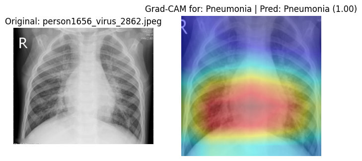

---

*True Negative*
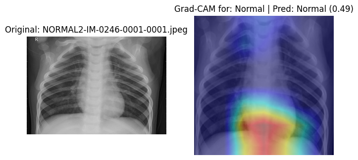

---

*False Postive*
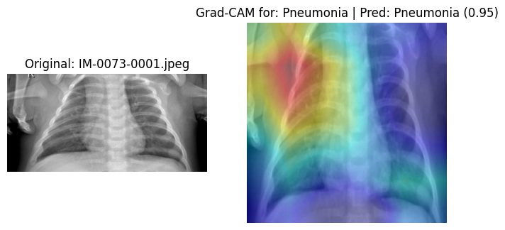

In this fale postive example, we can see the bone misleading the model.

---

## Occlusion Sensitivity Test

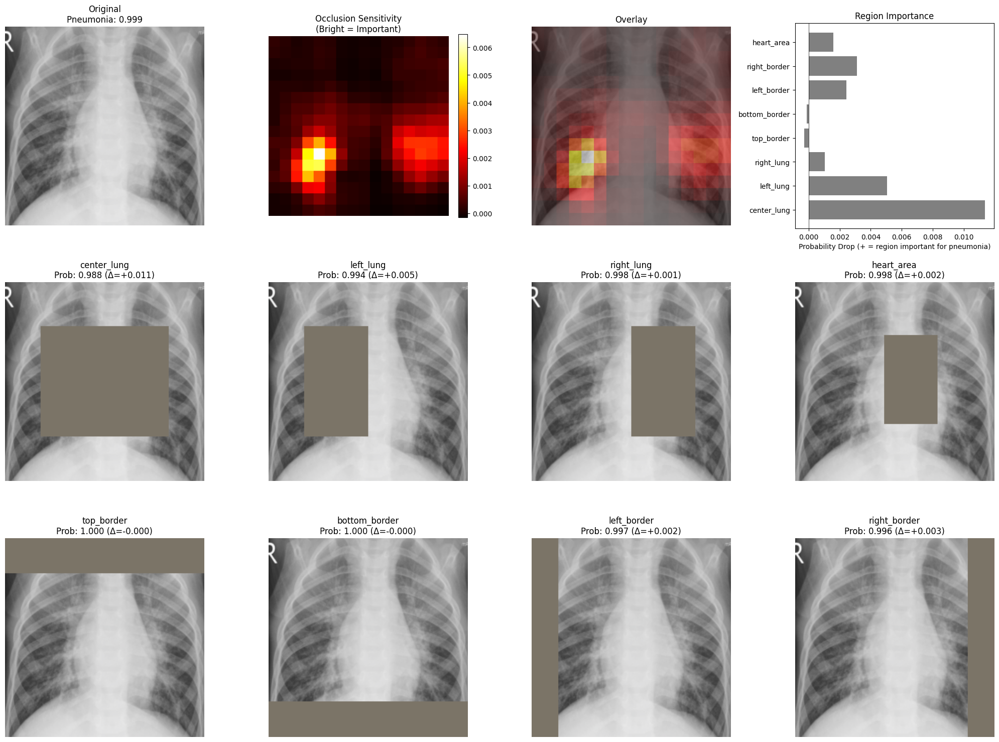

<!-- _footer: "Pheumonia, Model uses multiple regions, no clear focus" -->

---
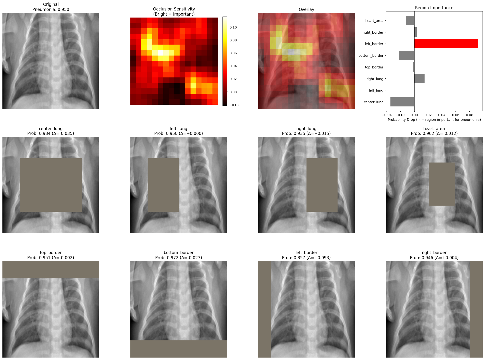

<!-- _footer: "Normal, False Postive, Model focuses on BORDER/NON-LUNG regions (potential bias!)" -->

---
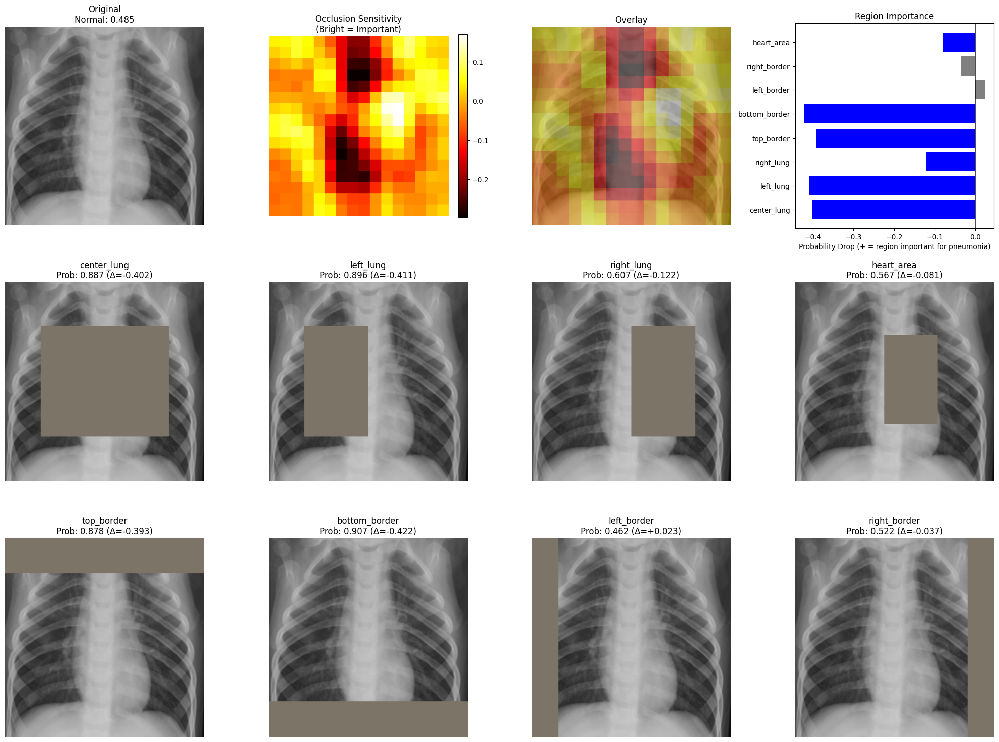
<!-- _footer: "Normal, Model uses multiple regions, no clear focus" -->
---

## LIME
### Pipeline
1. **Segmentation**: Using SLIC to generate Superpixels.
2. **Perturbation**: Generate 2000 samples by randomly hiding superpixels.
3. Prediction: Get model predictions for all 2000 perturbed images
4. **Samples Weighting**: Weight samples by similarity to original. 
5. **Fitting**: Fit interpretable model (e.g., linear regression). Model will pay more attention for high similarity samples.
6. **Explanation**: Superpixels with highest weights are most important
---
### Mathematical Formulation

LIME explains a prediction $f(x)$ by finding the best interpretable model $g$ (e.g., linear regression) that minimizes the following objective function:

$$ \xi(x) = \operatorname*{argmin}_{g \in G} \mathcal{L}(f, g, \pi_x) + \Omega(g) $$

Where:
- **$f$**: The complex black-box model (e.g., ResNet).
- **$g$**: The simple interpretable model (e.g., linear model $g(z) = w \cdot z$).
- **$\pi_x$**: The proximity measure (kernel) defining the neighborhood around $x$.
- **$\Omega(g)$**: Complexity penalty (e.g., number of non-zero weights).
- **$\mathcal{L}$**: The weighted loss function measuring how unfaithful $g$ is to $f$.
---
For a linear model $g(z) = w \cdot z$, this is solved by minimizing the **Weighted Squared Loss**:

$$ \mathcal{L}(f, g, \pi_x) = \sum_{z \in \mathcal{Z}} \underbrace{\pi_x(z)}_{\text{Similarity Weight}} \cdot \left( f(z) - \underbrace{w \cdot z}_{\text{Linear Pred}} \right)^2 $$

The optimization finds the **feature weights $w$** that best approximate the model's behavior in the local neighborhood of $x$.

---
### Results
*True Positive Example*:

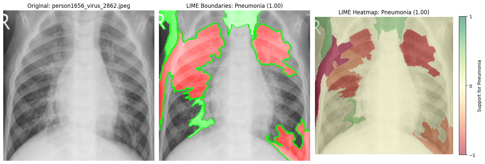

---

*True Negative Example*
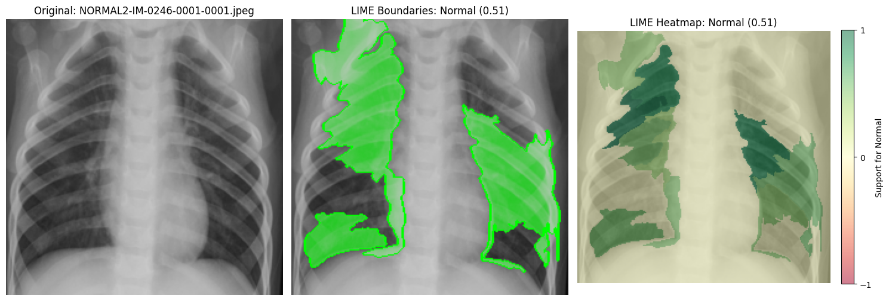

---

*False Postive*
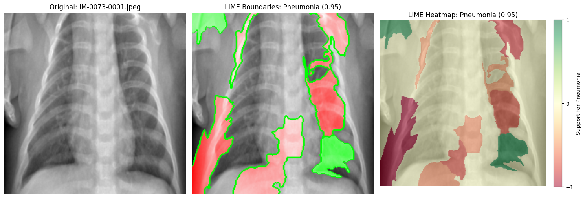
LIME's key features mainly focus on lung area, and could explain true negative examples better. 

---

## Explaination Comparsion

---

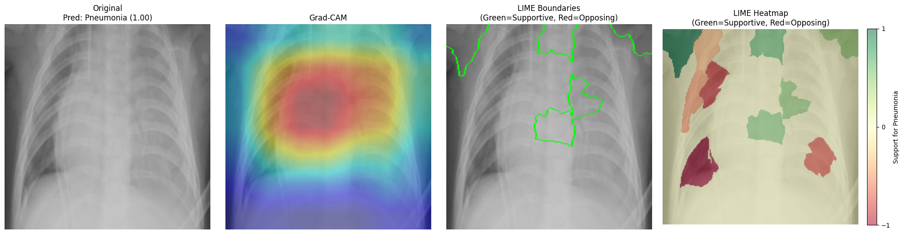

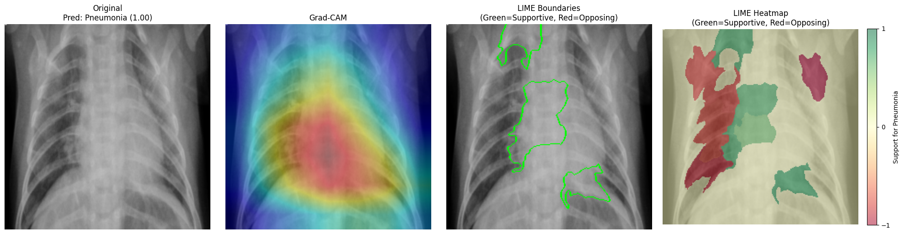

<!-- _footer: "True Postive: Both method find the supportive evidence in lung area." -->

---
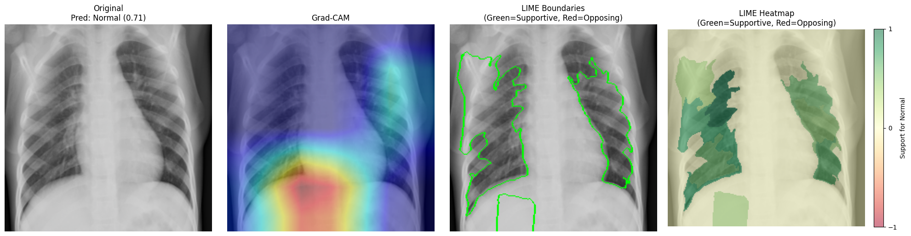
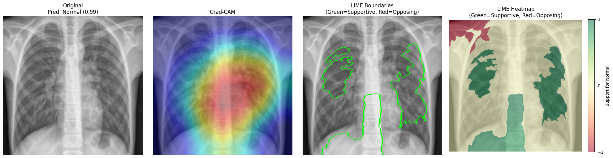
<!-- _footer: "True Negative: Also Activation area has overlap, but LIME focus more on lungs area." -->
---

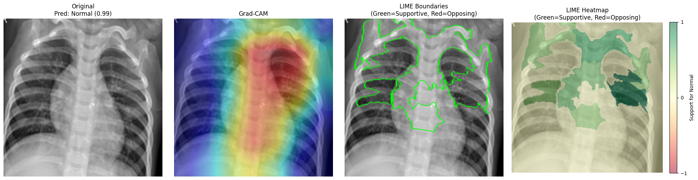
<!-- _footer: "False Negative: Grad-Cam show strong activation in the spine area, LIME still focus on lungs." -->
---
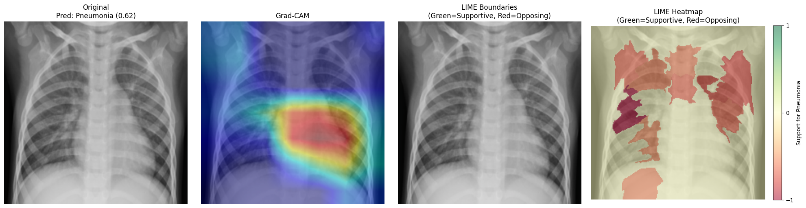
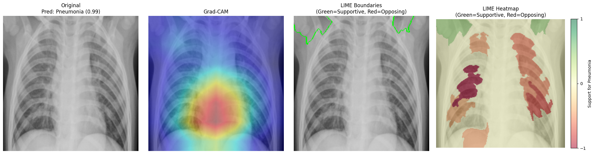
<!-- _footer: "False Postive: Grad-Cam still show strong activation in the spine area, LIME show that features in lung area didn't agree the result." -->
---
## XAI Method Comparison (Summary)

| Method | Output | Good for | Main risk | Seen in our results |
|---|---|---|---|---|
| **Grad-CAM** | Coarse heatmap | Quick localization | Can highlight confounders | FP: bone/spine attention |
| **Occlusion** | Mask-drop map | Bias / shortcut check | Slow + patch artifacts | Border/non-lung sensitivity |
| **LIME** | Superpixel weights | Lung-focused, signed clues | Depends on segmentation | TN/FP: lung focus clearer |
---

## Evaluation Criteria for Explanation Quality

### Criterion 1 Lung-Focus

**Definition**: The explanation should concentrate on clinically relevant anatomy (primarily lung fields for pneumonia) rather than borders, markers, ribs, or background.

**How to assess**
- **Quantitative**: Compute an “inside-lung attribution ratio”
- **Qualitative**: A radiologist rates whether highlighted regions correspond to lung opacities/expected patterns vs artifacts (e.g., borders).

---

## Criterion 2 — Faithfulness (Prediction Change When Evidence Removed)

**Definition**: If an explanation claims a region is important, then removing/occluding that region should meaningfully change the model’s output in the predicted direction.

**How to assess**
- **Deletion test**: Remove the top-$k\%$ highlighted pixels/superpixels (according to the explanation) and measure probability drop.

---

## Criterion 3 — Stability / Robustness

**Definition**: Explanations should be consistent under small, clinically irrelevant changes (tiny intensity shifts, minor crops/translation) and across similar images.

**How to assess**
- Re-run explanations under small perturbations and compute similarity (e.g., Spearman rank correlation of pixel importance, or IoU of top-$k\%$ regions).